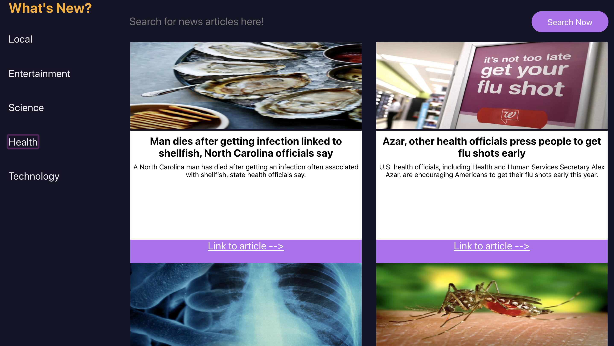

# Whats-New

### Overview
"What's New" is a solo project introducing react and testing with enzyme. The user can  choose which news topic they want to view and search for specific news articles.

### Technologies Used
This application was built with :

- create-react-app.
- Functional React Components
- Class React Components
- Testing (Enzyme/Jest)

### Setup Instructions
- Clone repo
- In your terminal, cd into repository
- Run "npm install"
- Run "npm start" 
- - The application should have opened in a browser
- You can now select a topic from the menu and filter by articles

### Images 

