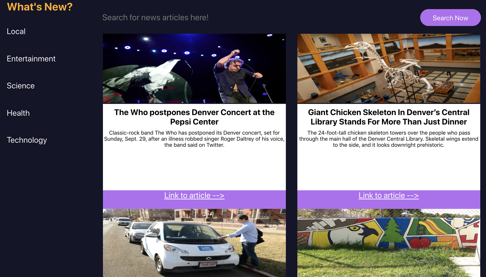

# Whats-New

## Author
Naomi Campos

### Overview
"What's New" is a solo project introducing react and testing with enzyme. The user can choose which news topic they want to view and search for specific news articles. This project was completed over 5 days. 

### Goals
- Write squeaky clean, well refactored code using ES6 syntax.
- Learn to pass information between components using props.
- Learn to write readable JSX (your render methods/return statements should be clean and simple).
- Use propTypes for every component receiving props.
- Learn how to unit test React components including snapshot testing, methods, and changes in state.
- Display different categories of current news.

### Technologies Used
- create-react-app.
- Functional React Components
- Class React Components
- Testing (Enzyme/Jest)

### Setup Instructions
- Clone repo
- In your terminal, cd into repository
- Run "npm install"
- Run "npm start" 
- - The application should have opened in a browser
- You can now select a topic from the menu and filter by articles

### Images 

